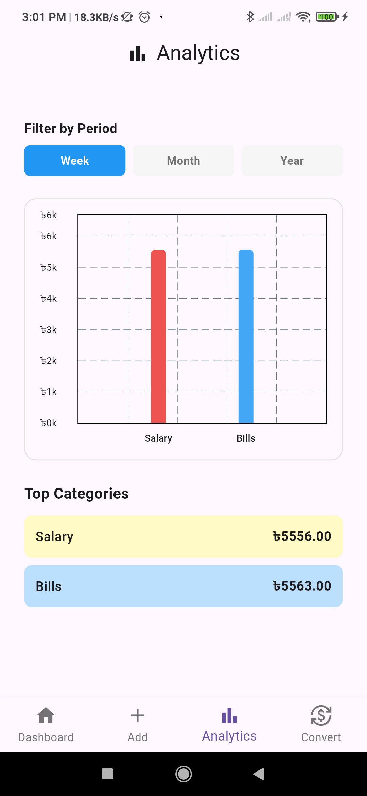
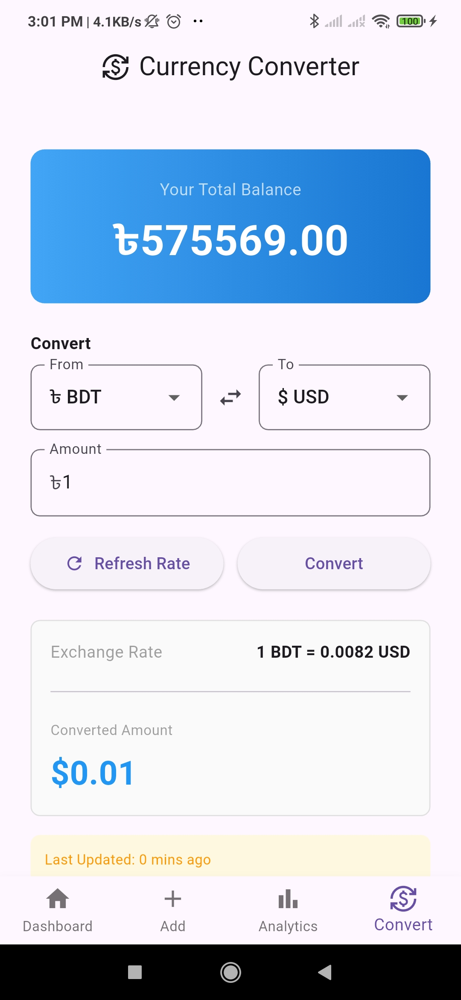

# Expense Tracker

A comprehensive Flutter application for tracking expenses, managing transactions, and analyzing spending patterns with real-time currency conversion.

## Features

### ✅ Completed Features

- **Transaction Management**
  - Add, edit, and delete transactions
  - Categorize expenses by type
  - Track transaction dates and amounts
  - View transaction history

- **Dashboard**
  - Overview of financial summary
  - Quick access to key metrics
  - Visual representation of spending data

- **Analytics & Reports**
  - Detailed expense analytics
  - Spending patterns visualization
  - Category-wise expense breakdown
  - Chart-based data representation

- **Currency Converter**
  - Real-time currency conversion
  - Support for multiple currencies
  - Live exchange rate updates via HTTP API

- **Data Persistence**
  - Local storage using SharedPreferences
  - Persistent transaction history
  - Automatic data saving

- **User Interface**
  - Material Design interface
  - Responsive layout
  - Smooth navigation using GoRouter
  - Intuitive add transaction flow

## Tech Stack

- **Framework**: Flutter 3.10.1+
- **State Management**: Provider 6.0.0
- **Navigation**: GoRouter 14.2.0
- **Local Storage**: SharedPreferences 2.2.2
- **Networking**: HTTP 1.1.0
- **Charts**: FL Chart 0.64.0
- **Localization**: Intl 0.18.1

## Prerequisites

- Flutter SDK: ^3.10.1
- Dart: ^3.10.1
- Android Studio / Xcode (for mobile development)
- Git

## Installation & Setup

### 1. Clone the Repository

```bash
git clone <repository-url>
cd expencetracker
```

### 2. Install Dependencies

```bash
flutter pub get
```

### 3. Generate Build Files (Optional)

```bash
flutter pub get
flutter clean
```

### 4. Run the Application

**On Android:**
```bash
flutter run -d android
```

**On iOS:**
```bash
flutter run -d ios
```

**On Web:**
```bash
flutter run -d chrome
```

**On Windows/macOS/Linux:**
```bash
flutter run
```

## Project Structure

```
lib/
├── main.dart                    # Entry point
├── app.dart                     # App configuration
├── app_router.dart              # Route management
├── config/                      # Configuration files
├── models/                      # Data models
│   ├── transaction.dart
│   └── currency_rate.dart
├── screens/                     # UI screens
│   ├── home.dart
│   ├── dashboard_screen.dart
│   ├── add_transaction_screen.dart
│   ├── analytics_screen.dart
│   └── currency_converter_screen.dart
├── services/                    # Business logic & APIs
└── widgets/                     # Reusable components
```

## Usage

### Adding a Transaction

1. Tap the "Add" button on the home screen
2. Enter the transaction amount
3. Select a category
4. Choose the transaction date
5. Save the transaction

### Viewing Analytics

1. Navigate to the Analytics tab
2. View spending patterns by category
3. Check total expenses and trends

### Converting Currency

1. Open the Currency Converter screen
2. Select source and target currencies
3. Enter the amount to convert
4. View real-time conversion rate

## Building for Production

### Android
```bash
flutter build apk --release
```

### iOS
```bash
flutter build ios --release
```

### Web
```bash
flutter build web --release
```

## Troubleshooting

- **Pub get errors**: Run `flutter clean` and `flutter pub get`
- **Build errors**: Ensure you have the correct Flutter SDK version (^3.10.1)
- **API errors**: Check internet connection for currency conversion API

## Screenshots

Screenshots of the application will be displayed here. Add your screenshot paths:


- Dashboard: 
- Add Transaction: 
- Analytics: 
- Currency Converter: 


## Contributing

1. Fork the repository
2. Create a feature branch (`git checkout -b feature/amazing-feature`)
3. Commit your changes (`git commit -m 'Add amazing feature'`)
4. Push to the branch (`git push origin feature/amazing-feature`)
5. Open a Pull Request

## License

This project is licensed under the MIT License - see the LICENSE file for details.

## Support

For support, email support@expensetracker.com or create an issue in the repository.

---

**Version**: 0.1.0  
**Last Updated**: 2025
